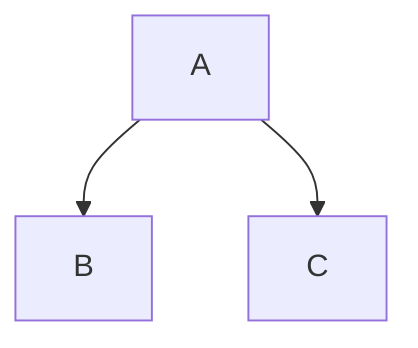

import { Card } from "fumadocs-ui/components/card";

## Code Block

```ts
console.log("Hello World");
```

## Cards

```ts
<Card title="Learn more about Next.js" href="https://nextjs.org/docs" />
<Card title="Learn more about Fumadocs" href="https://fumadocs.vercel.app" />
```

<Cards>
  <Card title="Learn more about Next.js" href="https://nextjs.org/docs" />
  <Card title="Learn more about Fumadocs" href="https://fumadocs.vercel.app" />
</Cards>

```package-install
npm install fumadocs-twoslash -D
```

## Another idea

This is another idea...

### This isn't it

```package-install
npm install fumadocs-twoslash -D
```

```math
c = \pm\sqrt{a^2 + b^2}
```

<Mermaid
  chart="
graph TD;
subgraph AA [Consumers]
A[Mobile app];
B[Web app];
C[Node.js client];
end
subgraph BB [Services]
E[REST API];
F[GraphQL API];
G[SOAP API];
end
Z[GraphQL API];
A --> Z;
B --> Z;
C --> Z;
Z --> E;
Z --> F;
Z --> G;"
/>


